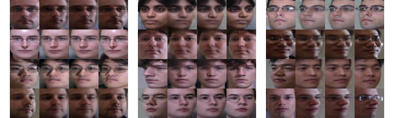
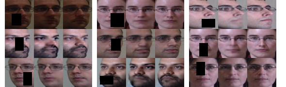

# bmvc16_face
# Introduction

This repository contains code to reproduce the face rotation experiments in section 4.1 of the paper [Towards Automatic Image Editing: Learning to See another You](http://homes.esat.kuleuven.be/~xjia/xjia_publications/xjia_bmvc16_facefinal.pdf), a BMVC 2016 paper by Amir Ghodrati\*, Xu Jia\*, Marco Pedersoli, Tinne Tuytelaars (\* Amir and Xu contributed equally).

We propose a method that aims at automatically editing an image by altering its attributes. More specifically, given an image of a certain class (e.g. a human face), the method should generate a new image as similar as possible to the given one, but with an altered visual attribute (e.g. the same face with a new pose or a different illumination).

If you use our code in your research, please cite following paper:
```
@inproceedings{face_bmvc16,
  author    = {Amir Ghodrati and Xu Jia and Marco Pedersoli and Tinne Tuytelaars},
  title     = {Towards Automatic Image Editing: Learning to See another You},
  booktitle = {BMVC},
  year      = {2016}
}
```
Face Rotation: <br />
 <br />
Change Illumination <br />
![face illumination] (./images/fig_ill.png) <br />
Image Inpainting <br />
 <br />

# Installing
* Install cuda 7.5, [Lasagne with small modification] (https://github.com/stephenjia/Lasagne), Theano 0.9.0dev2.dev-e4e08782d3a10d010d3a99bc87fd0fc3b0465405, cuDNN 5.0


# Demo
* Run the experiments for face rotation: <br />
First change the configuration of the experiment in ```config_stageX_color.py```
Then run
```
python train_stage1_color.py
```
to train the first stage model and write checkpoint files to the checkpoints directory. <br />
Then run
```
python train_stage2_color.py
```
to train the second stage model and write checkpoint files to the checkpoints directory. <br />
To evaluate the trained models on test data, run
```
python generate_triplet_demo_color.py
```


# Dataset
You need to first download MultiPIE dataset.
To crop and align faces, we use the code provided by Junho Yim for their cvpr15 paper titled ```Rotating Your Face Using Multi-task Deep Neural Network```. Please cite their paper if you use this code for face cropping and alignment.


